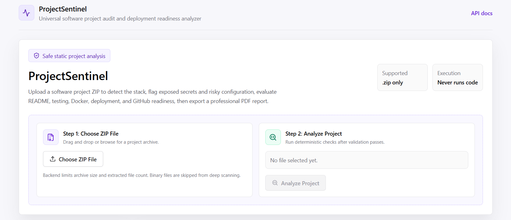
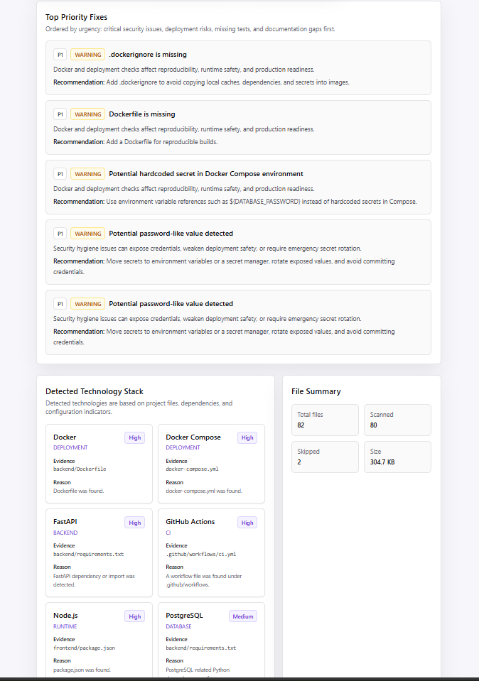
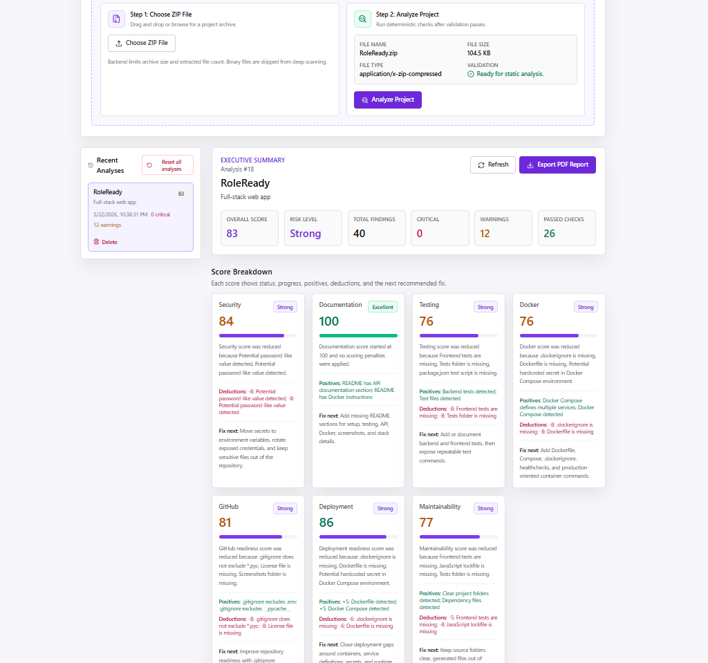
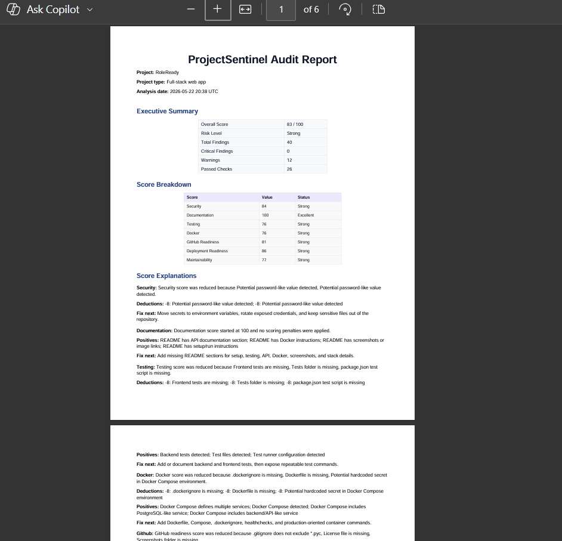

# ProjectSentinel

Universal Software Project Audit & Deployment Readiness Analyzer

ProjectSentinel analyzes uploaded software project archives for project quality, security hygiene, GitHub readiness, testing readiness, Docker/deployment readiness, and documentation quality. It does not execute uploaded code.

## Why This Project Exists

Developers often need a fast, consistent way to review whether a project is ready to share, deploy, or include in a portfolio. ProjectSentinel gives a deterministic audit of the basics that matter: exposed secrets, README quality, tests, Docker readiness, GitHub polish, dependency configuration, and deployment signals.

## Key Features

- Upload `.zip` software project archives.
- Safely extract archives with Zip Slip prevention and size/file-count limits.
- Detect common stacks including React, TypeScript, Vite, FastAPI, Flask, Express, Java, C/C++, Docker, Docker Compose, Pytest, Jest, Vitest, PostgreSQL, and GitHub Actions.
- Show evidence, reason, and confidence for detected technologies.
- Scan text files for `.env` files, secret-like strings, private keys, database URLs, JWT secrets, and suspicious credentials.
- Evaluate README, testing, Docker, GitHub readiness, dependencies, and project structure.
- Calculate explainable scores from 0 to 100 with status labels, positives, deductions, and recommended next fixes.
- Prioritize findings with P0 urgent, P1 high, P2 medium, and P3 low labels.
- Display a professional DevSecOps-style dashboard.
- Delete individual analyses or reset all stored analysis results.
- Export a clean PDF audit report with ReportLab.

## Tech Stack

- Frontend: React, TypeScript, Tailwind CSS, Vite
- Backend: FastAPI, Python, SQLAlchemy, PyYAML
- Database: PostgreSQL in Docker, SQLite fallback for local tests
- PDF: ReportLab
- Testing: Pytest
- Runtime: Docker Compose

## Architecture

```text
ProjectSentinel
├── frontend/        React + TypeScript + Tailwind dashboard
├── backend/         FastAPI API, analyzer, PDF report generator
├── docs/screenshots GitHub README screenshots
├── docker-compose.yml
└── README.md
```

The backend receives a ZIP file, validates and extracts it into a temporary directory, analyzes files statically, stores analysis results in the database, and deletes temporary files after analysis. ProjectSentinel does not execute uploaded code. The frontend calls the API and renders the upload flow, dashboard, findings, technology badges, recent analysis management, and PDF export link.

## Docker Setup

```bash
docker compose up --build
```

This Docker setup is optimized for local development/demo. A production deployment should serve the built frontend with nginx or another static server.

The local Docker setup configures the frontend with `VITE_API_URL=http://localhost:8003`, so browser requests target the backend published on `http://localhost:8003`. For non-local deployment, configure the frontend with the externally reachable backend API URL for that environment.

Vite environment variables are resolved during the frontend build. Deployments that change the backend URL may need to rebuild the frontend image with the correct `VITE_API_URL`, or add a separate runtime configuration approach before production use.

Frontend:

```text
http://localhost:5176
```

Backend docs:

```text
http://localhost:8003/docs
```

Health:

```text
http://localhost:8003/health
```

## Local Backend Setup

```bash
cd backend
python -m venv .venv
.venv\Scripts\activate
pip install -r requirements.txt
uvicorn app.main:app --reload --port 8000
```

The backend defaults to SQLite locally. Docker Compose uses PostgreSQL.

## Local Frontend Setup

```bash
cd frontend
npm install
npm run dev -- --port 5173
```

The frontend is exposed as `5176:5173` in Docker Compose.

## API Endpoints

- `GET /health` - service health check
- `POST /analyses/upload` - upload and analyze a `.zip` project archive
- `GET /analyses` - list recent analyses
- `GET /analyses/{analysis_id}` - get detailed analysis
- `GET /analyses/{analysis_id}/findings` - get findings for one analysis
- `GET /analyses/{analysis_id}/report` - export PDF audit report
- `DELETE /analyses/{analysis_id}` - delete one analysis and related rows
- `DELETE /analyses/reset` - delete all stored analyses and related rows

## Analysis Categories

- Security: `.env`, private key files, API keys, tokens, passwords, JWT secrets, database URLs
- Documentation: README presence, setup/run instructions, tech stack, screenshots, API docs
- Testing: tests directory, test files, Pytest/Jest/Vitest indicators
- Docker and deployment: Dockerfile, Docker Compose, multiple services, exposed ports, healthcheck, `.dockerignore`
- GitHub readiness: `.gitignore`, README, screenshots/assets, license, CI workflow
- Dependencies: package scripts, JavaScript lockfiles, broad dependency versions, Python pinned dependencies
- Structure: file inventory, skipped binary files, source directory conventions, dependency files, generated folders in uploaded archives

## Scoring Explanation

Scores are deterministic and start at 100 per category.

- Critical findings generally subtract 20 points.
- Warning findings generally subtract 8 points.
- Security criticals also reduce deployment readiness.
- Missing tests reduce testing and maintainability.
- Dockerfile and Docker Compose improve deployment readiness.
- Overall score is the average of security, documentation, testing, Docker, GitHub readiness, deployment readiness, and maintainability.
- API responses include a short explanation, main positives, and main deductions for each score.

Score status labels:

- 90-100: Excellent
- 75-89: Strong
- 60-74: Needs work
- 40-59: Risky
- 0-39: Critical

## Security Notes

- Uploaded code is never executed.
- Only `.zip` archives are accepted in the MVP.
- Unsafe paths, absolute paths, and `../` traversal are rejected.
- Encrypted ZIP archives are rejected.
- Maximum upload size, extracted file count, and extracted size are enforced.
- Binary and oversized files are skipped from deep content scanning.
- Temporary analysis directories are deleted after analysis.
- External vulnerability APIs are intentionally not used in the MVP.

## Testing

```bash
cd backend
python -m pytest
```

Frontend build:

```bash
cd frontend
npm install
npm run build
```

## Creating a Clean ZIP

Do not zip the working folder directly after `npm install`, frontend builds, or backend tests because generated folders and caches make the archive large. Use the export script to create a clean ZIP safely:

```powershell
.\scripts\export.ps1
```

The script creates a temporary clean copy outside the project, excludes generated artifacts such as `node_modules`, `dist`, `build`, `__pycache__`, `.pytest_cache`, virtual environments, test databases, `.env`, coverage files, and `*.pyc`, writes `ProjectSentinel.zip`, and deletes only the temporary export folder.

## Screenshots

### Upload Flow


### Audit Dashboard


### Findings Explorer


### PDF Report


## Future Improvements

- GitHub repository URL analyzer.
- Deeper GitHub Actions / CI/CD analyzer.
- Dockerfile deeper risk analyzer.
- License checker.
- Dependency vulnerability lookup.
- Cloud deployment readiness.
- Project comparison mode.
- AI-assisted explanations later if desired.
- Deployment to cloud later.
- Add deeper language-specific dependency parsing.
- Add optional SBOM generation.
- Add configurable scoring profiles.
- Add deeper Docker Compose validation and deployment risk recommendations.
- Add CI template recommendations.
- Add persistent report history search and comparison.
- Introduce Alembic migrations before production use.

## CV Bullet Point

ProjectSentinel — Universal Software Project Audit Platform. Built a Dockerized full-stack developer tool that analyzes uploaded software project archives, detects technology stacks, scans for exposed secrets and risky configuration files, evaluates README/testing/Docker/deployment readiness, calculates explainable project quality scores, and exports professional PDF audit reports.
